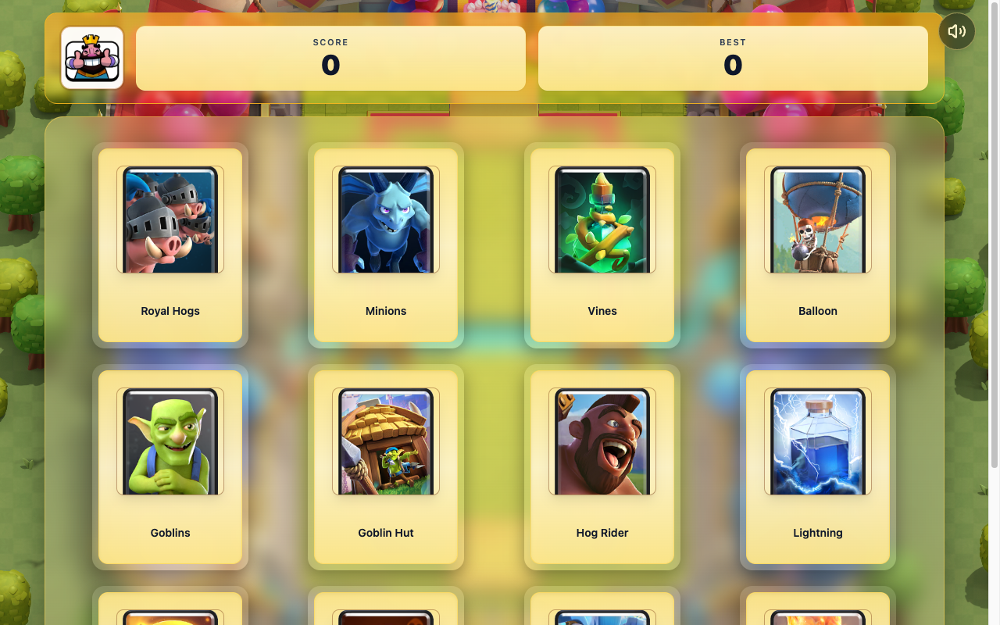

# Memory Card (Clash Memory)

A React memory game: click each card only once across rounds that reshuffle every turn.
Built to practice React hooks and stateful play loops.

🔗 **Live demo:** [memory-card-eight-sepia.vercel.app](https://memory-card-eight-sepia.vercel.app/)



## Features

- Card grid that shuffles each round to keep the challenge active.
- Current-score and best-score tracking across sessions.
- Sound controls with flip, shuffle, success, and miss feedback.
- Win/loss feedback tied to card artwork and game state.

## Tech stack

React · Vite · Tailwind CSS · `lucide-react`

## Getting started

```bash
npm install
npm run dev          # Vite dev server
npm run build        # production build
```

## What I practiced

Managing interdependent state with **React hooks** (flipped ids, score, best score, win
state), deriving UI from state, and handling a randomized game loop.

## License

Odin Project coursework — original implementation by Aziz Umarov.
